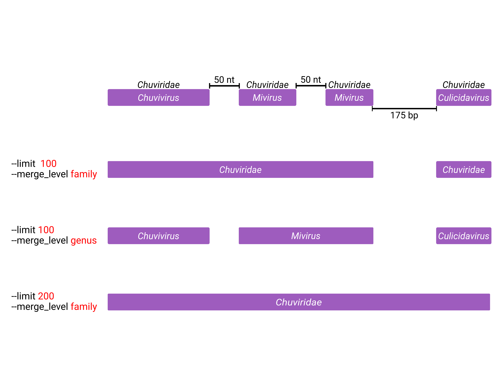
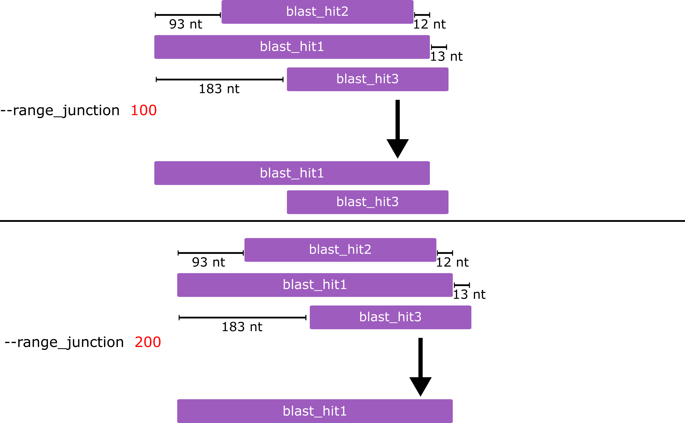

# Custom arguments

This page collects the tuning arguments that shape how EEfinder merges and
filters elements, with the worked examples from the wiki.

## Keeping temporary files

By default EEfinder archives its intermediate files under `tmp_files/` and,
when overlap filtering removes elements, under `tmp_outputs/`. Pass
`-rm`/`--removetmp` to delete the intermediates after a successful run instead.

## Merging fragmented elements

Endogenous viruses are ancestral integrations, and the endogenised regions
accumulate deletions and insertions over time. As a result a single ancestral
integration can survive as several fragments with slightly different — or
truncated — taxonomic assignments. Two arguments let you merge such fragments.

### Merge length (`-lm` / `--limit`)

Adjusts the distance used to merge two or more endogenous elements of the same
taxon (as defined by `--merge_level`) within a given range. A larger value merges
neighbouring fragments that a stricter value would keep apart.

### Merge level (`-ml` / `--merge_level`)

Selects the taxonomic level — `family` (default) or `genus` — used to decide
whether two neighbouring elements belong to the "same taxon" for merging.

## Range junction (`-rj` / `--range_junction`)

Sets the range used to clean redundant hits during the similarity analysis. The
filter is applied to the BLAST/DIAMOND results, keyed on the query name and the
start/end range of the query, so overlapping hits describing the same region
collapse to a single best hit.

Worked example — the three input hits all describe the same region, so EEfinder
keeps only the best-scoring one and infers its sense:

**Input**

| qseqid | sseqid | pident | length | qstart | qend | evalue | bitscore |
| ------ | ------ | ------ | ------ | ------ | ---- | ------ | -------- |
| aag2_ctg_162 | AAC97621 | 30.636 | 173 | 130612 | 130100 | 2.43e-08 | 69.7 |
| aag2_ctg_162 | AAU10897 | 23.611 | 216 | 130717 | 130073 | 2.52e-10 | 75.3 |
| aag2_ctg_162 | AOC55195 | 24.535 | 269 | 130864 | 130073 | 4.49e-11 | 77.8 |

**Output**

| qseqid | sseqid | pident | length | qstart | qend | evalue | bitscore | sense |
| ------ | ------ | ------ | ------ | ------ | ---- | ------ | -------- | ----- |
| aag2_ctg_162 | AOC55195 | 24.535 | 269 | 130073 | 130864 | 4.49e-11 | 77.8 | - |

Both AAC97621 and AAU10897 cover the same region as AOC55195, so they are removed
as redundant; the surviving hit's coordinates are ordered and its sense (`-`) is
recorded.

## Minimum contig length (`-ln` / `--length`)

Sets the minimum length of contigs passed to BLAST/DIAMOND. Contigs shorter than
this are dropped before the search (default `10000`; lower it for short test
contigs).

## Flank length (`-fl` / `--flank`)

Sets the length of the flanking regions extracted around each endogenous element
into `PREFIX.EEs.flanks.fa` (default `10000` nt on each side).

## Output prefix (`-pr` / `--prefix`)

Names the prefix EEfinder uses for output files and Element-IDs. Element names
are formatted as `PREFIX|CONTIG/SCAFFOLD:START-END`. We suggest combining the
genome and assembly names, e.g. **Ae_aeg_Aag2** for *Aedes aegypti* / Aag2.
